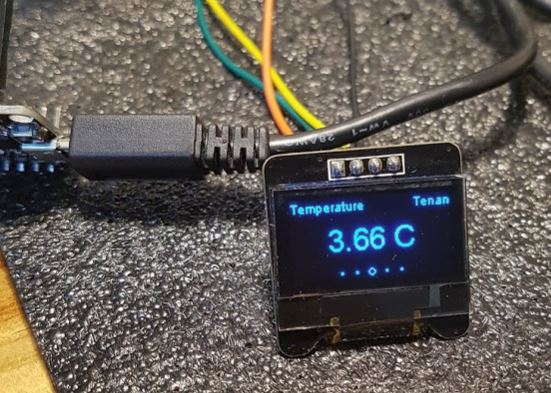

# ESP8266_WEATHER_OLED
Weather information using OpenWeatherMap API + SSD1306 Library

1. References
- SSD1306 library from https://github.com/ThingPulse/esp8266-oled-ssd1306  
- ArduinoJson library from https://github.com/bblanchon/ArduinoJson  

2. Tools & Others
 - OpenWeatherMap API service (https://openweathermap.org/)  
 - PlatformIO IDE (https://platformio.org/)  
 - Weather icons are downloaded from https://www.flaticon.com/  
  
 3. H/W
 - ESP8266 NodeMCU V2  
 - SSD1306 128x64 OLED  
 
 

